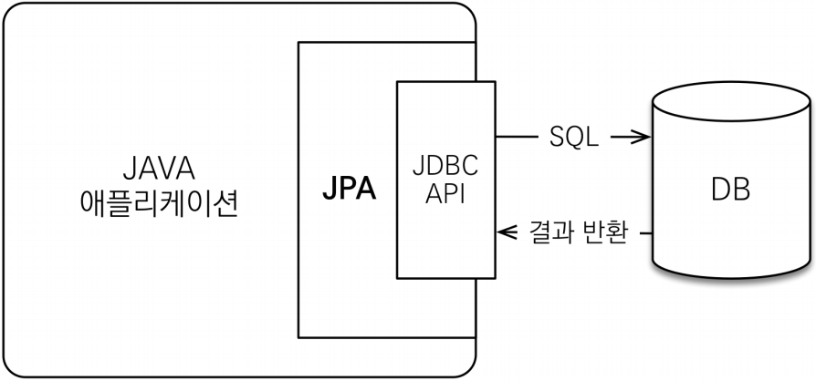
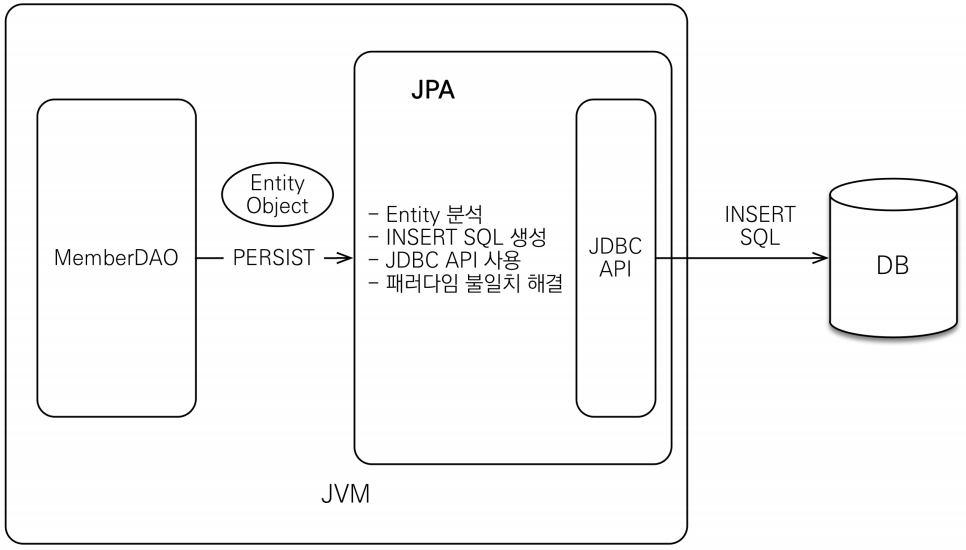
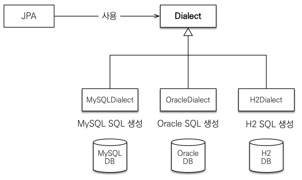
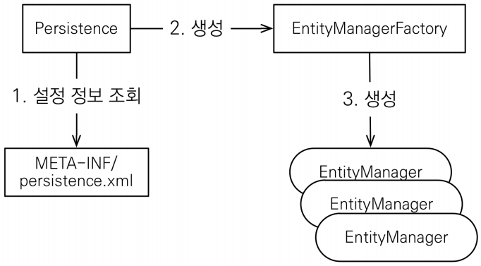
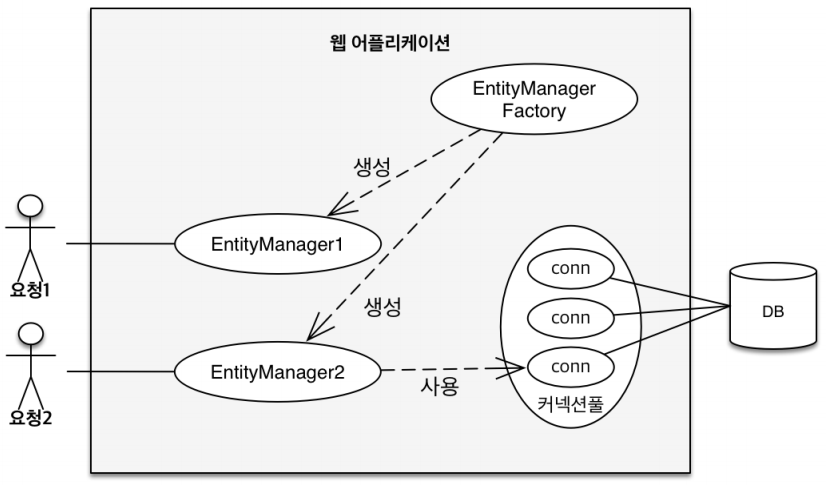
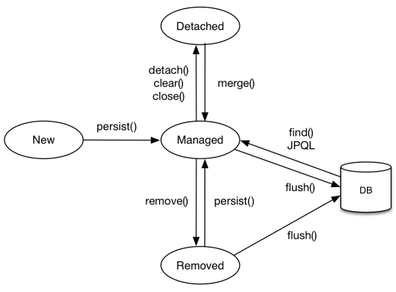
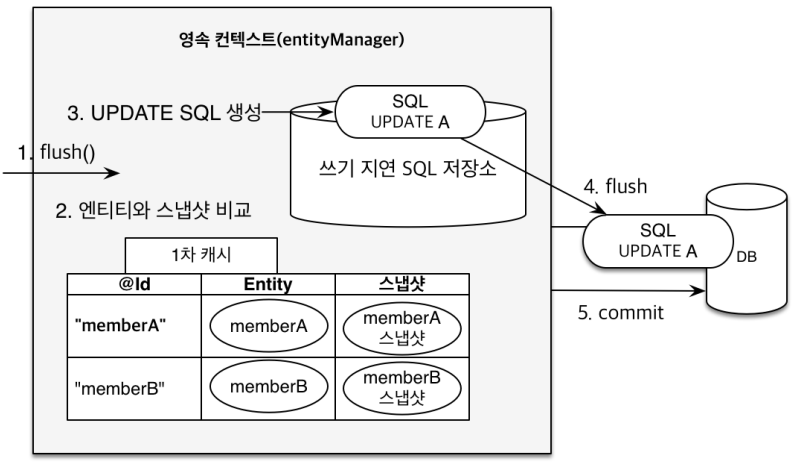

# JPA
Java Persistence API, 자바 진영의 ORM 기술 표준 인터페이스.

개발자 = SQL 매퍼 ㅠㅠ → 현재 하는 일

**동일 트랜잭션 내에서 조회한 엔티티가 같음을 보장하도록**, 객체를 자바 컬렉션에 저장 하듯이 DB에 저장할 수는 없을까? → JPA

JDBC → MyBatis or JdbcTemplate → JPA

---
- [ORM](#orm)
- [JPA의 동작](#jpa의-동작)
- [JPQL](#jpql)
- [영속성 관리](#영속성-관리)
- [엔티티 매핑](#엔티티-매핑)
- [연관관계 매핑](#연관관계-매핑)
---

## ORM
Object-Relational Mapping, 객체 관계 매핑으로 객체와 관계형 데이터베이스를 독립적으로 설계하고 ORM 프레임워크가 중간에서 매핑합니다.

---

## JPA의 동작

### 애플리케이션과 JDBC 사이에서 동작
<p align="center"></p><p align="center"></p>

DAO가 PK를 보내면, JPA가 쿼리를 만들어서 JDBC API를 사용하여 DB로 쿼리를 보내고 결과를 반환 받습니다. → **패러다임의 불일치 해결**

### JPA의 방언(dialect)
<p align="center"></p>

### JPA의 구동 방식
<p align="center"></p>

- `EntityManagerFactory`
최초 하나만 생성하여 애플리케이션 전체에서 공유합니다.
- `EntitiManager`
Thread 간에 공유하면 안 됩니다. Database Connection처럼 사용하고 버려야 합니다.
- JPA의 모든 데이터 변경은 트랜잭션 안에서 실행됩니다.

---

## JPQL
JPA를 사용하여 엔티티 객체를 중심으로 개발하는 쿼리로 SQL을 추상화한 객체 지향 쿼리 언어입니다.

### JPQL 특징
- SQL과 문법 유사하며 객체지향 SQL이라 할 수 있음.
- SQL은 데이터베이스 테이블을 대상으로 쿼리, JPQL은 엔티티 객체를 대상으로 쿼리로 **SQL에 의존적이지 않음.**
- 검색을 할 때도 **테이블이 아닌, 엔티티 객체를 대상으로 검색**
- 모든 DB 데이터를 객체로 변환해서 검색하는 것은 불가능
- 애플리케이션이 필요한 데이터만 DB에서 불러오려면, 결국 검색 조건이 포함된 SQL이 필요
- 검색 쿼리가 자유롭지 못 한 문제

---

## 영속성 관리
<p align="center"></p>

### 영속성 컨텍스트
엔티티를 영구 저장하는 환경이며 눈에 보이지 않는 논리적인 개념입니다. 엔티티 매니저를 통해 영속성 컨텍스트에 접근합니다.
- `EntityManager.persist(entity);` : entity를 영속성 컨텍스트에 저장합니다.
- J2SE 환경 - EntityManager : PersistenceContext = 1:1
- J2EE, 스프링 프레임워크 같은 컨테이너 환경 - EntityManager : PersistenceContext = N:1
### 엔티티의 생명주기
- 비영속(new/transient) : 영속성 컨텍스트와 전혀 관계 없는 새로운 상태
    ```java
    // 객체 생성(비영속)
    Member member = new Member();
    member.setId("member1");
    member.setUsername("회원1");
    ```
- 영속(managed) : 영속성 컨텍스트에 관리되는 상태
    ```java
    // 객체 생성(비영속)
    Member member = new Member();
    member.setId("member1");
    member.setUsername("회원1");
    
    EntityManager em = emf.createEntityManager();
    em.getTransacntion().begin();

    // 객체를 저장한 상태(영속)
    em.persist(member);

    ```
- 준영속(detached) : 영속성 컨텍스트에 저장되었다가 분리된 상태
    ```java
    // 영속
    Member member = em.find(Member.class, 150L);
    member.setName("AAAA"); // Dirty Checking

    // 더 이상 영속성 컨텍스트로 관리하기 싫으면
    em.detach(member);    // 이 것이 준영속
    ```
    - `entityManager.detach()` : 특정 엔티티만 준영속 상태로 전환
    - `entityManager.clear()` : 영속성 컨텍스트를 완전히 초기화
    - `entityManager.close()` : 영속성 컨텍스트를 종료
- 삭제(removed) : 삭제된 상태 
<p align="center"></p>

### 영속성 컨텍스트의 이점
- 1차 캐시
    - 동일 트랜잭션 안에서 다음 조회 시 DB 쿼리를 날리지 않도록 합니다.
        - 하지만, 클라이언트 10개가 동시에 요청을 날리면 10개의 별도 1차 캐시를 가집니다. 즉, 성능상의 이점은 크지는 않으며 해당 메커니즘을 통해 얻을 수 있는 이점들이 있습니다.
    - `persist()` 혹은 최초 쿼리 발생 시 저장.

- 동일성(identity) 보장
    - 1차 캐시로 반복 가능한 읽기(REPEATABLE READ)등급의 트랜잭션 격리 수준을, 데이터베이스가 아닌 애플리케이션 차원에서 제공합니다.
        ```java
        Member a = em.find(Member.class, "member1");
        Member b = em.find(Member.clase, "member1");

        System.out.println(a == b); // true
        ```
- 트랜잭션을 지원하는 쓰기 지연(transactional write-behind)
    - 버퍼링 : write를 모아서 한 번에 시행
        ```java
        EntityManager em = emf.createEntityManager();
        EntityTransaction transaction = em.getTransaction();
        // 엔티티 매니저는 데이터 변경 시 트랜잭션을 시작해야 합니다.
        transaction.begin();

        em.persist(memberA);
        em.persist(memberB);
        // 여기까진 SQL을 보내지 않습니다. 

        transaction.commit();   // 트랜잭션 커밋, 커밋하는 순간 DB에 INSERT SQL 전송
        // hibernate 설정으로 size조절 가능 >> 버퍼링
        ```
    - 쓰기 지연 SQL 저장소가 존재하여, `persist()` 사용 시 쿼리가 삽입됩니다.
    - `transaction.commit()` 시 쓰기 지연 SQL에 쌓인 쿼리들이 전송됩니다. 이 것을 `flush()`라고 합니다.
- 변경 감지(Dirty Checking)
    - JPA가 변경을 자동으로 감지하여 알려줍니다.
        ```java
        EntityManager em = emf.createEntityManager();
        EntityTransaction transaction = em.getTransaction();
        transaction.begin();

        // 영속 엔티티 조회
        Member memberA = em.find(Member.class, "memberA");

        // 영속 엔티티 데이터 수정
        memberA.setUsername("hi");
        memberA.setAge(10);

        transaction.commit();
        ```
    - `commit()` 시 `flush()`가 발생하는데, 1차 캐시의 Entity와 스냅샷을 비교하여 쓰기 지연 SQL저장소에 쿼리를 만들어 두고 한 번에 전송합니다.
    - `commit()`직전에만 동기화 하면 됩니다.
    <p align="center"></p>

    - `flush()` : 영속성 컨텍스트의 변경내용(쓰기 지연 SQL 저장소의 쿼리들)을 데이터베이스에 동기화합니다. ***1차 캐시, 영속성 컨텍스트를 비우는 것이 아님***
    - 보통 `FlushModeType.AUTO`로 자동으로 사용합니다.
        - flush() 방법 종류
            - `em.flush()` - 직접(강제) 호출
            - 트랜잭션 커밋 - 플러시 자동 호출
            - JPQL 쿼리 실행 - 플러시 자동 호출
 
- 지연 로딩(Lazy Loading)

---

## 엔티티 매핑
### 객체와 테이블 매핑 `@Table`
- `@Entity` : JPA가 관리하며, JPA를 사용하여 테이블과 매핑할 클래스에 필수로 붙습니다.
    - 기본 생성자 필수(파라미터가 없는 public 또는 protected 생성자)
    - final 클래스, enum, interface, inner 클래스 사용 불가
    - 저장할 필드에 final 사용 불가
    - 속성 : `name`
        - JPA에서 사용할 엔티티 이름 지정
        - 기본값 : 클래스 이름을 그대로 사용
        - 같은 클래스 이름이 없으면 가급적 기본값을 사용합니다.
- 필드와 컬럼 매핑 : `@Column`
- 기본키 매핑 : `@Id`
- 연관관계 매핑 : `@ManyToOne`, `@JoinColumn`


### 데이터 스키마 자동 생성
- DDL(`CREATE`,`ALTER`,`DROP`,`TRUNCATE`)을 애플리케이션 실행 시점에 자동 생성
- 테이블 중심 → 객체 중심
- DB 방언을 활용하여 DB에 맞는 적절한 DDL 생성 ***개발에서만 사용, 운영에서는 X → 적절히 다듬하여 사용***
- `hibernate.hbm2ddl.auto`
    |옵션|설명|
    |:---|:---|
    |`create`|기존테이블 삭제 후 다시 생성 (DROP + CREATE)|
    |`create-drop`|CREATE와 같으나, **종료 시점에 테이블 DROP**|
    |`update`|변경분만 반영 ***운영 DB 사용 자제, db lock 위험***|
    |`validate`|엔티티와 테이블이 정상 매핑되었는지만 확인|
    |`none`|사용하지 않음|
    - **운영 DB에는 절대 `create`, `create-drop`, `update`를 사용하면 안 됩니다.**
    - 개발 초기 단계는 `create`, `update` 사용
    - 테스트 서버는 `update`, `validate` 사용
    - 스테이징과 운영 서버는 `validate`, `none` 사용
- DDL 생성 기능 : DDL 자동 생성 시에만 사용 되고, JPA의 실행 로직에는 영향을 주지 않습니다.
    - 제약 조건 : 회원 이름 필수, 10자 초과 불가능
        - `@Column(nullable = false, length = 10)`
        - `@Column(unique = true, length = 10)`
    - 유니크 제약조건 추가
        - `@Table(uniqueConstraints = {UniqueConstraint(name = "NAME_AGE_UNIQUE", columnNames={"NAME", "AGE"})}`

### 필드와 컬럼 매핑
|어노테이션|설명|
|:---|:---|
|`@Column`|컬럼 매핑|
|`@Temporal`|날짜 타입 매핑|
|`@Enumerated`|enum 타입 매핑|
|`@Lob`|BLOB, CLOB 매핑|
|`@Transient`|특정 필드를 컬럼에 매핑하지 않음(매핑 무시)|

#### `@Enumerated`
- EnumType.ORDINAL : enum 순서를 데이터베이스에 저장합니다. **기본값이지만 컬럼 추가, 혹은 순서가 변경 된다면, 예기치 못한 문제가 발생할 수 있으니 지양합니다.** 
- EnumType.STRING : enum 이름을 데이터베이스에 저장합니다.  **문자열 자체가 저장되기 때문에 DB 공간 낭비가 발생합니다.**
    - DB공간을 조금 낭비하더라도 STRING을 쓰는 게 안전합니다.

---

## 연관관계 매핑
### 연관관계가 필요한 이유
"객체지향 설계의 목표는 자율적인 객체들의 협력 공동체를 만드는 것이다." - 조영호(객체지향의 사실과 오해)<br />
객체를 테이블에 맞추어 데이터 중심으로 모델링하면, 협력 관계를 만들 수 없습니다. 테이블은 외래 키로 조인하여 연관된 테이블을 찾지만, 객체는 참조를 사용해서 연관된 객체를 찾습니다. **테이블과 객체 사이에는 이러한 차이가 있습니다.**
- 필자의 해석 
    ```
    JOIN 시에 객체관계 맵핑은 상속개념으로 데이터를 바로 가져올 수 있지만, 테이블은 그 자체로 고윳값을 가지지 못 하기 때문에 기본키-외래키 맵핑 연산으로 데이터를 가져와야 합니다. 이 것은 객체지향의 상속 개념에도 위반되며 객체지향 관점의 협력 관계라고 볼 수 없습니다.
    ```

### 양방향 연관관계
테이블 연관관계에서는 PK로 연결된 양방향 연관관계가 1개가 존재합니다. 반면, 객체 관계에서는 두 객체 사이에 서로 다른 단방향 관계가 2개 존재함을 의미합니다.

즉, 객체를 양방향으로 참조하려면 단방향 연관관계를 2개 만들어야 합니다.
```java
A -> B (a.getB())
B -> A (b.getA())

class A {
    B b;
}

class B {
    A a;
}
```

### 연관관계의 주인(Owner)
양방향 매핑 규칙
- 객체의 두 관계중 하나를 연관관계의 주인으로 지정합니다.
- **연관관계의 주인만**이 외래 키를 관리합니다.(등록 수정을 위함)
- **주인이 아닌쪽은 읽기만 가능**합니다.
- 주인은 `mappedBy` 속성을 사용하지 않습니다.
- 주인이 아니면 `mappedBy` 속성으로 주인을 지정합니다.
- 주인은 외래 키를 보유한 곳을 권장합니다. (비즈니스 로직을 기준으로 선택하면 안 됨)
- **순수 객체 상태를 고려하여, 항상 양쪽에 값을 설정해야 합니다.**
    - 연관관계 편의 메소드를 생성하여 실수를 대비합니다.
        ```java
        // 한 쪽에 작성.
        public void changeTeam(Team team) {
            this.team = team;
            team.getMembers().add(this);
        }
        ```
- 무한루프를 조심합니다. `toString(), lombok. JSON 생성 라이브러리`
    - Controller에서 Entity를 반환하면 절대 안 됩니다.
        - DTO로 변환하여 반환합니다.

### 양방향 매핑 정리
- 양방향 매핑은 반대 방향으로 조회(객체 그래프 탐색) 기능이 추가된 것일 뿐, 단방향 매핑만으로도 이미 연관관계 매핑은 완료입니다.
- JPQl에서 역방향 탐색할 일이 많습니다.
- 단방향 매핑을 잘 해두면, 양방향 매핑은 필요할 때 추가해도 됩니다.(테이블에 영향을 주지 않습니다.)

### 연관관계 매핑 시 고려사항 3가지
- 다중성
    - 다대일 `N:1`
        - 외래 키가 있는 쪽이 연관관계의 주인
        - 양쪽을 서로 참조하도록 개발
    - 일대다 `1:N`
        - 테이블 관점에서 `다`쪽에 외래 키(일쪽에 외래 키가 들어갈 수가 없습니다.  `팀-멤버`에서 팀에 외래키면 계속 팀에 insert → 불가능, 중복) 
        - `1`이 연관관계의 주인
        - 객체와 테이블의 차이 때문에, 반대편 테이블의 외래키를 관리하는 특이한 구조
        - 엔티티가 관리하는 외래 키가 다른 테이블에 존재
        - 연관관계 관리를 위해 추가로 UPDATE SQL 실행
        - 일대다 단방향 매핑보다는 **다대일 양방향 매핑** 권장
    - 일대일 `1:1`
        - 일대일 관계는 그 반대도 일대일
        - 주 테이블이나 대상 테이블 중에 외래 키 선택 가능
        - 외래 키에 데이터베이스 유니크(UNIQUE) 제약조건이 추가되어야 합니다.
        - 다대일 양방향 매핑 처럼 외래 키가 있는 곳이 주인입니다. *반대편은 `mappedBy` 적용*
        - 대상 테이블에 외래 키가 있는 단방향 관계는 JPA가 지원하지 않습니다. *양방향은 지원*
    - 다대다 `N:M`
        - 실무 사용 x

- 단방향, 양방향
    - 테이블
        - 외래 키 하나로 양쪽 조인 가능.
        - 사실 방향이라는 개념이 없음.
    - 객체
        - 참조용 필드가 있는 쪽으로만 참조 가능
        - 한쪽만 참조하면 단방향
        - 양쪽이 서로 참조하면 양방향
- 연관관계의 주인
